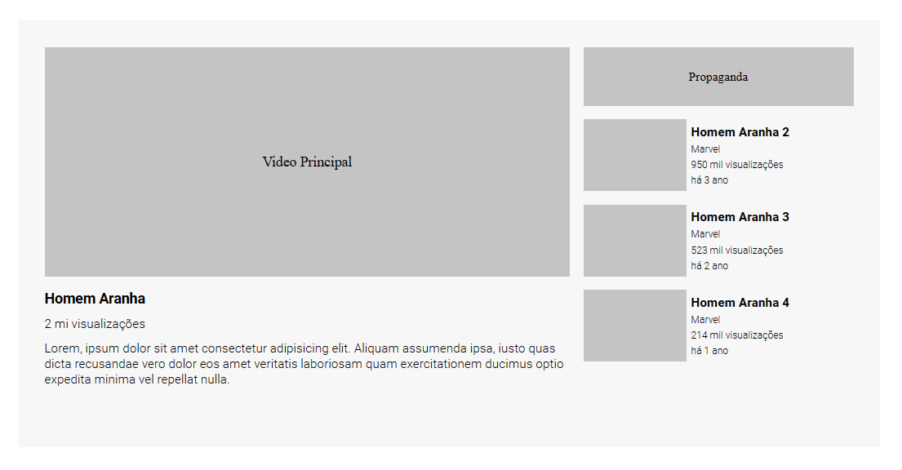

# Desafio Layout YouTube

Esse é um desafio solicitado pelo curso dev-quest, onde consegui realizar sozinho e me testar, onde o principal objetivo era criar um Layout parecido com o do YouTube. Para ser aprimorado as habilidades de posicionamento de elementos usando o display Flex e Grid. Gostei muito do resultado e do que aprendi até aqui, vou continuar praticando!

### Layout

